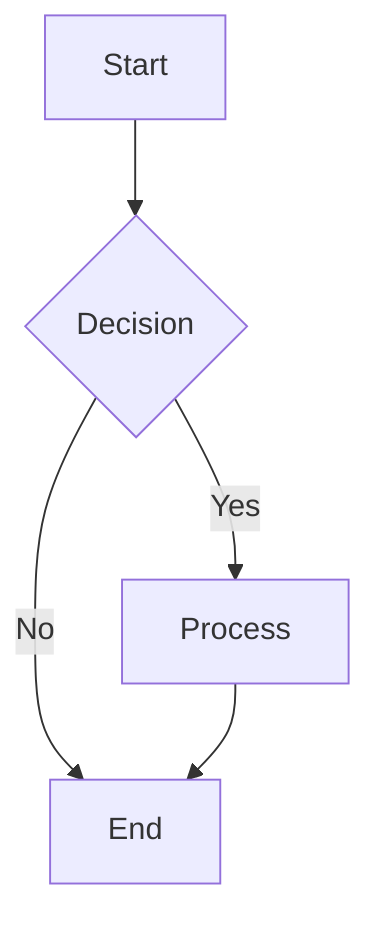
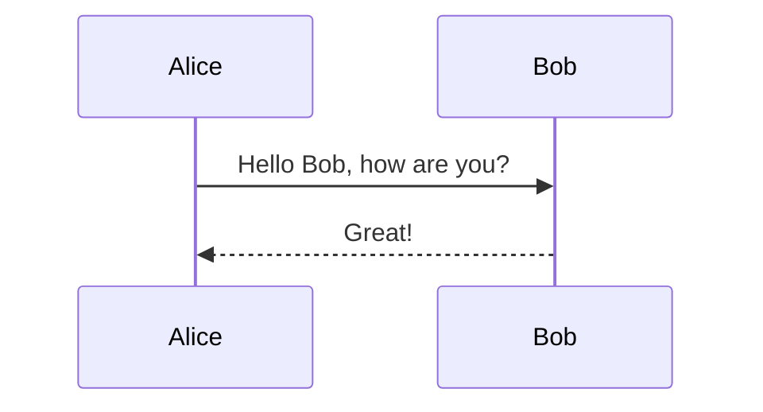

# Merval Test Suite

This directory contains a comprehensive test suite for **Merval** - the world's first zero-dependency Mermaid diagram validator, covering all supported diagram types and edge cases.

## Test Structure

The test suite is organized into several specialized test files:

- **`setup.ts`** - Test utilities and helper functions
- **`flowchart.test.ts`** - Flowchart diagram validation tests
- **`sequence.test.ts`** - Sequence diagram validation tests  
- **`other-diagrams.test.ts`** - Tests for other diagram types (class, state, charts, block diagrams, etc.)
- **`error-handling.test.ts`** - Error conditions and edge cases
- **`integration.test.ts`** - Complex real-world scenarios
- **`index.test.ts`** - Main test runner and reporting
- **`cli-validation/`** - Tests that validate against real Mermaid CLI

## Running Tests

### Run All Tests
```bash
npm test
```

### Run Specific Test Suites
```bash
npm run test:flowchart      # Flowchart tests only
npm run test:sequence       # Sequence diagram tests only
npm run test:other          # Other diagram types tests
npm run test:error          # Error handling tests
npm run test:integration    # Integration tests
```

### Watch Mode
```bash
npm run test:watch          # Run tests in watch mode
```

### CLI Validation Tests
```bash
# Validate against real Mermaid CLI (requires @mermaid-js/mermaid-cli)
node src/test/cli-validation/validate-against-cli.js
```

## Test Coverage

### Flowchart Tests (50+ tests)
- ✅ Basic flowchart syntax
- ✅ All direction types (TD, LR, BT, RL)
- ✅ Node shapes (rectangular, round, diamond)
- ✅ Arrow labels and styling
- ✅ Subgraphs and complex structures
- ✅ ClassDef and styling statements
- ✅ Comments and special statements
- ❌ Error cases (malformed syntax, missing arrows)

### Sequence Diagram Tests (30+ tests)
- ✅ Basic sequence syntax
- ✅ Participant declarations and aliases
- ✅ All arrow types (->>, -->, -), -))
- ✅ Message labels and formatting
- ✅ Complex multi-participant flows
- ❌ Error cases (undeclared participants, malformed messages)

### Other Diagram Types (25+ tests)
- ✅ Class diagrams
- ✅ State diagrams (v1 and v2)
- ✅ Pie charts
- ✅ XY charts (bar and line)
- ✅ Journey diagrams
- ✅ Gitgraph diagrams
- ✅ Mindmap diagrams
- ✅ Timeline diagrams
- ✅ Gantt charts
- ✅ ER diagrams
- ❌ Error cases (unknown diagram types, empty inputs)

### Error Handling Tests (40+ tests)
- ✅ Input validation (null, undefined, non-string)
- ✅ Malformed syntax detection
- ✅ Unicode and special characters
- ✅ Very long inputs and performance
- ✅ Mixed content scenarios
- ✅ Boundary conditions

### Integration Tests (15+ tests)
- ✅ Real-world flowchart examples
- ✅ Complete business process flows
- ✅ Complex sequence diagrams
- ✅ Multi-service communication patterns
- ✅ Extensive styling scenarios

### CLI Validation Tests (17+ tests)
- ✅ Compatibility with real Mermaid CLI
- ✅ Unicode and special character handling
- ✅ Mixed diagram type support
- ✅ Complex diagram validation
- ✅ Block diagram support
- ✅ Error case compatibility
- ✅ Production readiness verification

## Test Examples

### Valid Flowchart


### Valid Sequence Diagram


### Error Case
```mermaid
flowchart TD
  A B  // Missing arrow between adjacent nodes
```

## Test Results Format

Each test run provides:
- ✅ Pass/fail status for each test
- 📊 Summary statistics
- 🎯 Overall success rate
- 📋 Suite-by-suite breakdown
- ⏱️ Execution time

## Adding New Tests

To add new tests:

1. **Choose the appropriate test file** based on diagram type
2. **Use the helper functions** from `setup.ts`:
   ```typescript
   createTestCase(name, input, expectedValid, options)
   createTestSuite(name, description, testCases)
   assertValidationResult(result, expected)
   ```
3. **Follow the existing patterns** for test structure
4. **Include both positive and negative test cases**
5. **Add descriptive names and comments**

## Test Data Sources

The test cases are based on:
- Official Mermaid.js documentation
- Real-world usage patterns
- Common error scenarios
- Edge cases and boundary conditions
- Performance considerations

## Continuous Integration

The test suite is designed to run in CI environments:
- No external dependencies required
- Fast execution (< 1 second for full suite)
- Clear pass/fail reporting
- Exit codes for automation

## Future Enhancements

Planned improvements:
- [ ] Code coverage reporting
- [ ] Performance benchmarking
- [ ] Visual regression testing
- [ ] Property-based testing
- [ ] Mutation testing
- [ ] Test data generation
